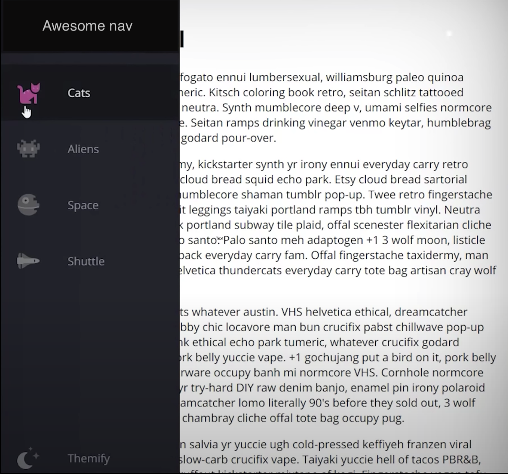

## Challenge

Add styles to the existing template in order to achieve the following result:

### Hints 
- Navbar should be closed by default.
- When hovering over the navbar it should open up above the content and show the menu item names.
- Use desktop first approach and for the navbar-mobile use a media query for when the screen width is smaller than 700px shift the navigation to the bottom of the page.
- Desktop first approach means create the styles for desktop first.
- PS: The example can be found online so don't search for it and don't copy the code :D Try to solve it yourself using positioning and the functionalities we have learned in the flexbox example.
- PS: The icons don't look like those in the images, don't worry about them, they don't have to :D 

- Bonus points: Manage to animate the navbar when it transitions from closed state to open state, nothing fancy for example slow the growth of the navbar so that it doesn't expand instantly.

## Navbar

## Navbar open

## Navbar mobile (Under 700px)

